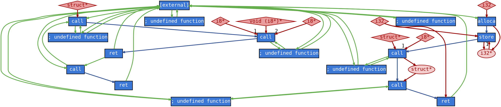

# Perfograph: Numerical Aware Program Graph Representation
Code and package for perfograph as laid out in the paper ["PERFOGRAPH: A Numerical Aware Program Graph Representation for Performance Optimization and Program Analysis](https://arxiv.org/abs/2306.00210).

This repository is designed to create graph representations of source code that are numerically aware, contain composite data structure information, and properly present variables.

Examples are shown below.

## Supported Programming Languages
- C
- C++
- LLVM-IR

## Use Cases
- Program Analysis
- Performance Optimization
- Parallelism Discovery

## Getting Started
This project requires Graphviz to be installed:

#### Linux
`sudo apt-get install graphviz-dev`

#### MacOS:
`brew install graphviz`

##### A note for MacOS with ARM Architecture
Some of the python dependencies are only available on x86, so you must emulate this environment for the program to work. An example with conda is shown below:

```
brew install miniconda
conda create -n my_x86_env -y
conda activate my_x86_env
conda config --env --set subdir osx-64
conda install python=3.8
conda install -c conda-forge pygraphviz
```


## Installation
`pip install git+https://github.com/tehranixyz/perfograph`

## Usage
PERFOGRAPH is simple to use. Further examples can be found in the examples folder. This graph will be using the following CPP code as found in `examples/samples/program.cpp`:
```cpp
int main()
{
    int a[] = {1, 2, 3};
    int sum = a[0] + a[1] + a[2];
    return 0;
}
```

To create a graph:
```python
import perfograph as pg

G = pg.from_file("examples/samples/program.cpp")
```
Parameters:
- 'file': Path to program file
- 'llvm_version': (Optional) Specify the LLVM version for LLVM IR files. Default is '10'
- 'with_vectors': (Optional) Include vector and array information in the graph. Default is 'True'
- 'disable_progress_bar': (Optional) Disable the progress bar display. Default is 'False'

#### Dot Graph
To create a DOT graph:
```python
pg.to_dot(G, "examples/sample_graph.pdf")
```
Parameters:
- 'graph': Perfograph object that you wish to transform into a DOT graph
- 'file': Ouput file location. Supports all output formats as found [here](https://graphviz.org/docs/outputs/)



#### DOT Graph Legend
| Node Type Name | Node Type ID | Shape           | Color     | Rounded | 
|----------------|--------------|-----------------|-----------|---------|
| Instruction    | 0            | Rectangle       | Blue      |    No   |
| Variable       | 1            | Ellipse         | Red       |   Yes   |
| Constant       | 2            | Diamond         | Light Red |    No   |
| Variable Array | 3            | Hexagon         | Red       |    No   |
| Variable Vector| 4            | Octagon         | Red       |    No   |
| Constant Array | 5            | Rounded Box     | Light Red |   Yes   |
| Constant Vector| 6            | Parallelogram   | Light Red |    No   |

| Edge Type Name | Edge Type ID | Color |
|----------------|--------------|-------|
| Control        | 0            | Blue  |
| Data           | 1            | Red   |
| Call           | 2            | Green |

#### JSON Graph
```python
pg.to_json(G, "examples/sample_json_graph.json")
```
Parameters:
- 'graph': Perfograph object you wish to convert to JSON
- 'file': (Optional) Output file that you wish for you JSON to be stored in. Leaving this field blank will return a JSON dictionary

[Example](./examples/sample_json_graph.json)

In the JSON graph, there is an original array with three dictionaries in that array. The first dictionary represents nodes as follows:
- instruction
- variable
- constant
- varray (variable arrays)
- vvector (variable vectors)
- carray (constant arrays)
- cvector (constant vectors)

The second dictionary contains the edges of the graph in the format {node_type}_{edge_type}_{node_type}. The two numbers provided under each edge are indexes. The first index represents the index of the first node_type and the second index represents the index of the second node_type. The types of edges are as follows:
- control
- data
- call

The third dictionary contains atributes for the edges. This dictionary stores an array with the length of the number of edges of that respective type and stores a value of the position of the edge. This position represents the dependency of that edge. For example, for an edge from A to B with position 0 and another edge C to B with position 1, the edge with position 0 would need to execute before the edge with position 1.

If any of the entries are empty, it means that there are nodes/edges of that particular type.

## Error Handling
The module raises 'ValueError' if an unsupported file format is provided or if an invalid output file type is specified.

## License
This project is licensed under the Apache 2.0 License - see the [LICENSE](LICENSE) file for details
